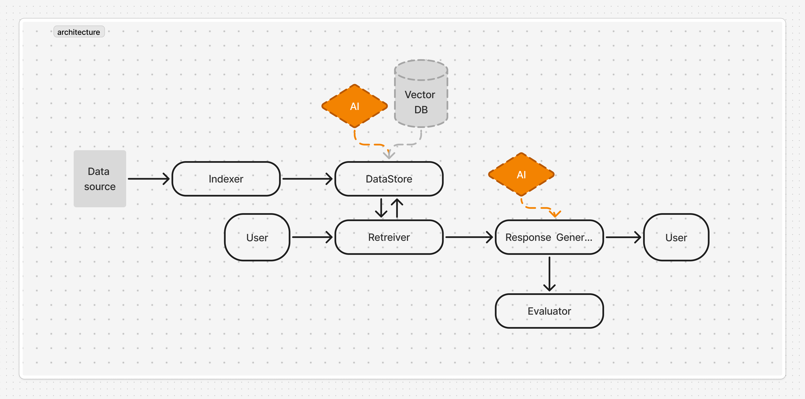

# Simple RAG Pipeline

> A beginner-friendly RAG (Retrieval Augmented Generation) system with powerful evaluation capabilities and a modern web interface.



---

## ✨ Features

- 🔍 **Document Indexing** - Process PDFs into searchable chunks with semantic embeddings
- 📊 **Vector Search** - Fast similarity search powered by LanceDB
- 🎯 **Smart Retrieval** - Two-stage retrieval with vector search + Cohere re-ranking
- 🤖 **AI Response Generation** - Natural language answers using OpenAI's GPT models
- 📈 **Comprehensive Evaluation** - Precision, Recall, and MRR metrics with AI-powered correctness checking
- 🌐 **Web Interface** - Interactive evaluation dashboard built with Reflex
- ⚡ **CLI Tools** - Powerful command-line interface for all operations

---

## 🎯 Use Cases

This project is perfect for:
- **Learning RAG fundamentals** - Clean, well-documented codebase
- **Prototyping RAG applications** - Modular architecture for easy customization
- **Evaluating RAG performance** - Built-in metrics and testing framework
- **Document Q&A systems** - Production-ready components

---

## 🚀 Quick Start

### Prerequisites

- Python 3.13+ (3.11+ should work)
- [OpenAI API Key](https://platform.openai.com/api-keys)
- [Cohere API Key](https://cohere.com/)

### Installation

```bash
# Clone the repository
git clone <your-repo-url>
cd simple-rag-pipeline

# Run the automated setup script
bash scripts/setup_env.sh

# Or manually:
python -m venv venv
source venv/bin/activate  # On Windows: venv\Scripts\activate
pip install -r requirements.txt
```

### Configuration

```bash
# Copy the environment template
cp .env.example .env

# Edit .env with your API keys
# OPENAI_API_KEY=your-key-here
# CO_API_KEY=your-key-here
```

### Index Sample Documents

```bash
# Index the provided sample documents
python main.py add -p "sample_data/source/"
```

You should see output like:
```
🔍 Adding documents: sample_data/source/auratechdynamics_history.pdf, ...
✅ Indexed 63 chunks
```

---

## 💻 Usage

### Command Line Interface

#### Query Documents
```bash
python main.py query "What year was AuraTech Dynamics founded?"
```

#### Add More Documents
```bash
# Single file
python main.py add -p "path/to/document.pdf"

# All files in a directory
python main.py add -p "path/to/documents/"
```

#### Run Evaluation
```bash
# Evaluate with sample questions
python main.py evaluate

# Or use the convenience script
bash scripts/run_evaluation.sh
```

#### Reset Database
```bash
# Clear all data and start fresh
python main.py reset

# Or use the interactive script
bash scripts/reset_database.sh
```

#### Run Full Pipeline
```bash
# Reset, index, and evaluate in one command
python main.py run
```

### Web Interface

Start the evaluation dashboard:

```bash
reflex run
```

Then open **http://localhost:3000** in your browser.

**Features:**
- Select from 25 pre-loaded test questions
- View generated vs. expected answers
- See detailed retrieval metrics (Precision, Recall, MRR)
- Analyze AI reasoning for answer correctness
- Explore retrieved source chunks

---

## 📁 Project Structure

```
simple-rag-pipeline/
│
├── src/                          # Core RAG pipeline
│   ├── rag_pipeline.py           # Main orchestrator
│   ├── interface/                # Abstract base classes
│   ├── impl/                     # Concrete implementations
│   └── util/                     # Helper utilities
│
├── rag_chat_app/                 # Reflex web interface
│   ├── rag_chat_app.py           # Main app
│   ├── eval_state.py             # State management
│   ├── models.py                 # Database models
│   └── components/               # UI components
│
├── sample_data/                  # Example data
│   ├── source/                   # Sample PDF documents
│   └── eval/                     # Test questions with ground truth
│
├── docs/                         # Documentation
│   ├── SETUP.md                  # Detailed setup guide
│   └── ARCHITECTURE.md           # System architecture
│
├── scripts/                      # Utility scripts
│   ├── setup_env.sh              # Automated environment setup
│   ├── run_evaluation.sh         # Run evaluation with checks
│   └── reset_database.sh         # Interactive database reset
│
├── main.py                       # CLI entry point
├── create_parser.py              # CLI argument parser
├── rxconfig.py                   # Reflex configuration
└── requirements.txt              # Python dependencies
```

See [docs/ARCHITECTURE.md](docs/ARCHITECTURE.md) for detailed component descriptions.

---

## 🏗️ Architecture

The system follows a modular, interface-based design:

```
User Query
    ↓
[Indexer] → Process documents → [Datastore (LanceDB)]
    ↓
[Retriever] → Vector search + Re-ranking → Top-K chunks
    ↓
[Response Generator] → OpenAI API → Natural language answer
    ↓
[Evaluator] → Compare + Metrics → Evaluation results
```

### Core Components

- **Datastore** - LanceDB vector database for embeddings
- **Indexer** - PDF processing and chunking (using Docling)
- **Retriever** - Two-stage retrieval (vector search + Cohere re-ranking)
- **Response Generator** - OpenAI-powered answer generation
- **Evaluator** - Metrics calculation and AI-powered correctness checking

All components implement abstract interfaces for easy customization.

---

## 📊 Evaluation Metrics

The system provides comprehensive evaluation:

### Retrieval Metrics

- **Precision** - % of retrieved documents that are relevant
  ```
  Precision = |Retrieved ∩ Relevant| / |Retrieved|
  ```

- **Recall** - % of relevant documents that were retrieved
  ```
  Recall = |Retrieved ∩ Relevant| / |Relevant|
  ```

- **MRR (Mean Reciprocal Rank)** - Ranking quality metric
  ```
  MRR = 1 / rank_of_first_relevant_doc
  ```

### Answer Quality

- **AI-Powered Correctness** - GPT-4 compares generated vs. expected answers
- **Reasoning** - Detailed explanation of the correctness judgment

---

## 🔧 Configuration

### Environment Variables

Create a `.env` file (see `.env.example`):

```env
OPENAI_API_KEY=your-openai-api-key-here
CO_API_KEY=your-cohere-api-key-here
```

### Reflex Configuration

Edit `rxconfig.py` to customize:
- Database URL
- API endpoints
- Frontend/backend ports

---

## 📚 Documentation

- **[Setup Guide](docs/SETUP.md)** - Detailed installation and configuration
- **[Architecture](docs/ARCHITECTURE.md)** - System design and component details
- **[Cleanup Guide](CLEANUP_RECOMMENDATIONS.md)** - Project maintenance recommendations

---

## 🧪 Sample Data

The project includes sample documents about "AuraTech Dynamics," a fictional company:

- `auratechdynamics_history.pdf` - Company history and milestones
- `auratechdynamics_services_2025.pdf` - Service catalog
- `auratechdynamics_contact_and_studio_directory_2025.pdf` - Contact information

Plus 25 test questions with ground truth answers for evaluation.

---

## 🛠️ Technology Stack

### Backend
- **Python 3.13** - Core language
- **LanceDB** - Vector database
- **OpenAI API** - Embeddings and LLM
- **Cohere API** - Re-ranking
- **Docling** - PDF parsing
- **SQLAlchemy** - ORM for chat history

### Frontend
- **Reflex** - Python-based web framework
- **React** - UI rendering (via Reflex)
- **Chakra UI** - Component library (via Reflex)

---

## 🚧 Troubleshooting

### API Key Errors

**Problem:** `OpenAI API key not found`

**Solution:**
1. Check `.env` file exists in project root
2. Verify keys are correct (no spaces around `=`)
3. Restart the application

### No Results Found

**Problem:** Queries return no results

**Solution:**
```bash
# Re-index documents
python main.py reset
python main.py add -p "sample_data/source/"
```

### Port Already in Use

**Problem:** `Address already in use`

**Solution:** Reflex automatically uses alternative ports (3001, 8001). Check terminal output for actual URLs.

See [docs/SETUP.md](docs/SETUP.md) for more troubleshooting tips.

---

## 🎓 Learning Resources

### Understanding RAG

This project demonstrates key RAG concepts:
1. **Document Processing** - Parsing and chunking
2. **Embeddings** - Converting text to vectors
3. **Vector Search** - Finding similar content
4. **Context Augmentation** - Providing relevant info to LLM
5. **Response Generation** - Creating natural language answers
6. **Evaluation** - Measuring system performance

### Extending the Project

The modular architecture makes it easy to:
- Add new document types (implement `BaseIndexer`)
- Swap vector databases (implement `BaseDatastore`)
- Use different LLMs (implement `BaseResponseGenerator`)
- Customize retrieval (implement `BaseRetriever`)
- Add new metrics (extend `BaseEvaluator`)

---

## 🤝 Contributing

Contributions are welcome! This project aims to be a learning resource for RAG systems.

### Areas for Improvement

- [ ] Additional document formats (Word, HTML, etc.)
- [ ] More evaluation metrics
- [ ] Conversation context tracking
- [ ] Document management UI
- [ ] Batch evaluation reports
- [ ] Multi-user authentication
- [ ] Advanced visualization

---


## 🙏 Acknowledgments

Built with:
- [LanceDB](https://lancedb.com/) - Fast vector database
- [Reflex](https://reflex.dev/) - Python web framework
- [Docling](https://github.com/DS4SD/docling) - Document processing
- [OpenAI](https://openai.com/) - Embeddings and LLMs
- [Cohere](https://cohere.com/) - Re-ranking API

---

## 📧 Support

- **Documentation:** Check the `docs/` folder
- **Issues:** Open a GitHub issue
- **Questions:** See [docs/SETUP.md](docs/SETUP.md) for troubleshooting

---

**Happy RAG Building! 🚀**

---

*This project is designed for learning and prototyping. For production use, consider additional security, scalability, and monitoring features.*
